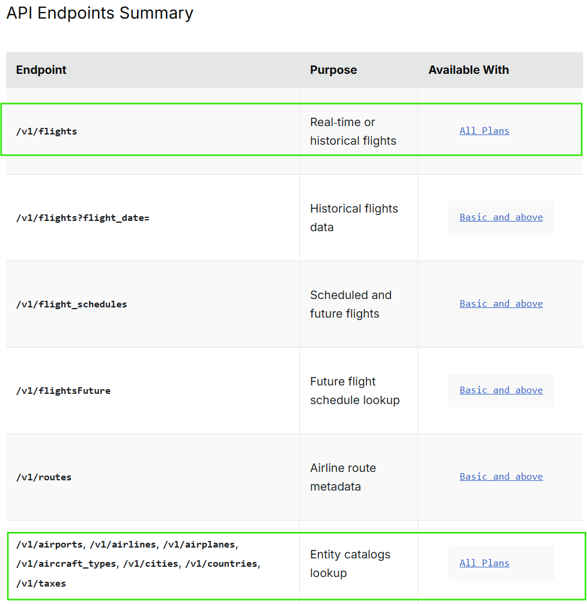

# Airlines project

## Discovery

As the lufthansa API has closed the registration we had to change to another API. We found the Aviationstack API https://aviationstack.com/ where we have a limited access to flights data. 

Everyone needs to register and get an access token on the website.

For free plans the data is limited to 100 calls a month so round about 3 a day.



Two kinds of informations ca be requested

- Real time flights data with /v1/flights

- Kind of master data like airports, airlines, airplanes etc.

## Example of flights data

The data is collected via https://api.aviationstack.com/v1/flights GET request.

```
{
	"pagination": {
		"limit": 100,
		"offset": 0,
		"count": 100,
		"total": 10000
	},
	"data": [
		{
			"flight_date": "2026-09-03",
			"flight_status": "scheduled",
			"departure": {
				"airport": "Brisbane International",
				"timezone": "Australia/Brisbane",
				"iata": "BNE",
				"icao": "YBBN",
				"terminal": "I",
				"gate": "79",
				"delay": null,
				"scheduled": "2026-09-03T00:05:00+00:00",
				"estimated": "2026-09-03T00:05:00+00:00",
				"actual": null,
				"estimated_runway": "2026-09-03T00:05:00+00:00",
				"actual_runway": null
			},
			"arrival": {
				"airport": "Hong Kong International",
				"timezone": "Asia/Hong_Kong",
				"iata": "HKG",
				"icao": "VHHH",
				"terminal": "1",
				"gate": null,
				"baggage": null,
				"scheduled": "2026-09-03T06:50:00+00:00",
				"delay": null,
				"estimated": null,
				"actual": null,
				"estimated_runway": null,
				"actual_runway": null
			},
			"airline": {
				"name": "Cathay Pacific",
				"iata": "CX",
				"icao": "CPA"
			},
			"flight": {
				"number": "156",
				"iata": "CX156",
				"icao": "CPA156",
				"codeshared": null
			},
			"aircraft": {
                "registration": null,
                "iata": null,
                "icao": null,
                "icao24": "408177"
            },
			"live": null
		}
	]
}
```

The data was shortenend to one record, you get 100 records per call ob the free plan.

As can be seen, every flights record is separted in several objects:

- departure

- arrival

- airline

- flight

- aircraft

- general information like flight date, status, and live. In the live object there was never seen anything else then null.

## Example of airports data

The airports data is a list of all airports in the following format

```
{
  "pagination": {
    "offset": 0,
    "limit": 100,
    "count": 100,
    "total": 6688
  },
  "data": [
    {
      "id": "9969436",
      "gmt": "-10",
      "airport_id": "1",
      "iata_code": "AAA",
      "city_iata_code": "AAA",
      "icao_code": "NTGA",
      "country_iso2": "PF",
      "geoname_id": "6947726",
      "latitude": "-17.05",
      "longitude": "-145.41667",
      "airport_name": "Anaa",
      "country_name": "French Polynesia",
      "phone_number": null,
      "timezone": "Pacific/Tahiti"
    }
  ]
}
```

Again the data was shortend to one record.

The airport data can be matched with the flights data by the IATA code in arrival/departure.

## Example of airlines data

```
{
  "pagination": {
    "offset": 0,
    "limit": 100,
    "count": 100,
    "total": 13169
  },
  "data": [
    {
      "id": "12680618",
      "fleet_average_age": "10.9",
      "airline_id": "1",
      "callsign": "AMERICAN",
      "hub_code": "DFW",
      "iata_code": "AA",
      "icao_code": "AAL",
      "country_iso2": "US",
      "date_founded": "1934",
      "iata_prefix_accounting": "1",
      "airline_name": "American Airlines",
      "country_name": "United States",
      "fleet_size": "963",
      "status": "active",
      "type": "scheduled"
    }
  ]
}
```

Again the data was shortend to one record.

The airline data can be matched with the flights data by the IATA code in airline.

## Example of airplane data

```
{
  "pagination": {
    "offset": 0,
    "limit": 100,
    "count": 100,
    "total": 19098
  },
  "data": [
    {
      "id": "18312559",
      "iata_type": "B737-300",
      "airplane_id": "1",
      "airline_iata_code": "0B",
      "iata_code_long": "B733",
      "iata_code_short": "733",
      "airline_icao_code": null,
      "construction_number": "23653",
      "delivery_date": "1986-08-21T22:00:00.000Z",
      "engines_count": "2",
      "engines_type": "JET",
      "first_flight_date": "1986-08-02T22:00:00.000Z",
      "icao_code_hex": "4A0823",
      "line_number": "1260",
      "model_code": "B737-377",
      "registration_number": "YR-BAC",
      "test_registration_number": null,
      "plane_age": "31",
      "plane_class": null,
      "model_name": "737",
      "plane_owner": "Airwork Flight Operations Ltd",
      "plane_series": "377",
      "plane_status": "active",
      "production_line": "Boeing 737 Classic",
      "registration_date": "0000-00-00",
      "rollout_date": null
    }
  ]
}
```

Here the ICAO24 seems to match with the ICAO code hex from the airlines data. The fields of IATA code as mostly empty in the example flights data.

## Aircraft types

```
{
  "pagination": {
    "offset": 0,
    "limit": 100,
    "count": 100,
    "total": 313
  },
  "data": [
    {
      "id": "22228",
      "iata_code": "100",
      "aircraft_name": "Fokker 100",
      "plane_type_id": "1"
    }
  ]
}
```

Here the IATA code seems to match with the IATA code short of the airplane data.

## Taxes

```
{
  "pagination": {
    "offset": 0,
    "limit": 100,
    "count": 100,
    "total": 521
  },
  "data": [
    {
      "id": "36992",
      "tax_id": "1",
      "tax_name": "Government Tax",
      "iata_code": "AB"
    },
    {
      "id": "36993",
      "tax_id": "2",
      "tax_name": "Value Added Tax",
      "iata_code": "AC"
    },
    {
      "id": "36994",
      "tax_id": "3",
      "tax_name": "Passenger Service Charge (International)",
      "iata_code": "AE"
    }
  ]
}
```

This is a list of taxes probably per city/airport - looks not so relevant.

## Cities data

```
{
  "pagination": {
    "offset": 0,
    "limit": 100,
    "count": 100,
    "total": 9374
  },
  "data": [
    {
      "id": "8922957",
      "gmt": "-10",
      "city_id": "1",
      "iata_code": "AAA",
      "country_iso2": "PF",
      "geoname_id": null,
      "latitude": "-17.05",
      "longitude": "-145.41667",
      "city_name": "Anaa",
      "timezone": "Pacific/Tahiti"
    }
  ]
}
```

This data can be matched by the city IATA code from the airports data.

## Countries data

```
{
  "pagination": {
    "offset": 0,
    "limit": 100,
    "count": 100,
    "total": 252
  },
  "data": [
    {
      "id": "238645",
      "capital": "Andorra la Vella",
      "currency_code": "EUR",
      "fips_code": "AN",
      "country_iso2": "AD",
      "country_iso3": "AND",
      "continent": "EU",
      "country_id": "1",
      "country_name": "Andorra",
      "currency_name": "Euro",
      "country_iso_numeric": "20",
      "phone_prefix": "376",
      "population": "84000"
    }
```

This data can be matched to airports data by country ISO 2 code.